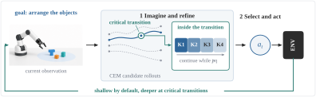
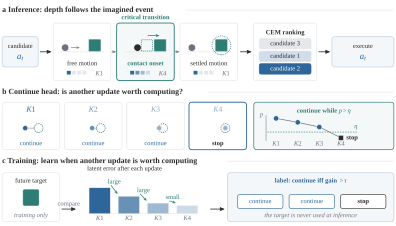
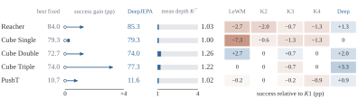
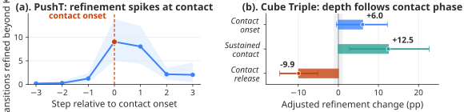

# DeepJEPA: Scaling World Models from Within

[](https://arxiv.org/pdf/2610.00368)
[](https://deepjepa.github.io/)

**Zijian Jin\*, Yunbei Zhang\*, Yuanzhe Liu, Ming Liu, Baian Chen, Weirui Ye, Shilong Liu, Marco Pavone**<br>
\*Equal contribution



## Overview

World-model planners typically scale outward by rolling farther, sampling more trajectories, or optimizing longer while assigning the same computation to every imagined transition. DeepJEPA introduces a complementary test-time scaling axis: **adaptive recurrent depth inside each latent transition**.

A weight-tied joint-embedding predictive world model learns whether another recurrent update is worth computing for each candidate and rollout step. Most transitions remain shallow. Additional computation concentrates at decision-critical events where latent corrections can change CEM rankings, elite membership, and the selected action.

Across five visual-control settings, DeepJEPA improves or matches the strongest fixed-depth planner while averaging only **1.00–1.26 updates per transition**.

## Method



DeepJEPA turns each imagined transition into a budgeted computation process:

1. A weight-tied recurrent cell produces successive latent predictions.
2. A continue head independently selects depth for every candidate and rollout step.
3. The selected latent state is returned to the unchanged outer CEM planner.
4. Training labels continuation using marginal latent prediction improvement. Future target latents are never used at inference.

## Main results



| Task | Best fixed | DeepJEPA | Gain | Mean depth |
|---|---:|---:|---:|---:|
| Reacher | 84.0 | **85.3** | +1.3 | 1.03 |
| Cube Single | 79.3 | **79.3** | 0.0 | 1.00 |
| Cube Double | 72.7 | **74.0** | +1.3 | 1.26 |
| Cube Triple | 74.0 | **77.3** | +3.3 | 1.22 |
| PushT | 10.7 | **11.6** | +0.9 | 1.02 |

Values are mean success rates over three training and evaluation seed pairs. Mean depth is the average number of selected recurrent updates per imagined transition.

## Where computation goes



Adaptive computation is interaction aligned. Refinement rises at PushT contact onset and during sustained Cube Triple contact, even though the continue head receives no contact labels. This supports the paper's central view: allocate internal computation where it can change the planner's decision instead of making every rollout uniformly deeper or longer.

## Citation

```bibtex
@article{jin2026deepjepa,
  title={DeepJEPA: Scaling World Models from Within},
  author={Jin, Zijian and Zhang, Yunbei and Liu, Yuanzhe and Liu, Ming and Chen, Baian and Ye, Weirui and Liu, Shilong and Pavone, Marco},
  journal={arXiv preprint arXiv:2610.00368},
  year={2026}
}
```

## Links

- [Paper](https://arxiv.org/pdf/2610.00368)
- [Project page](https://deepjepa.github.io/)
